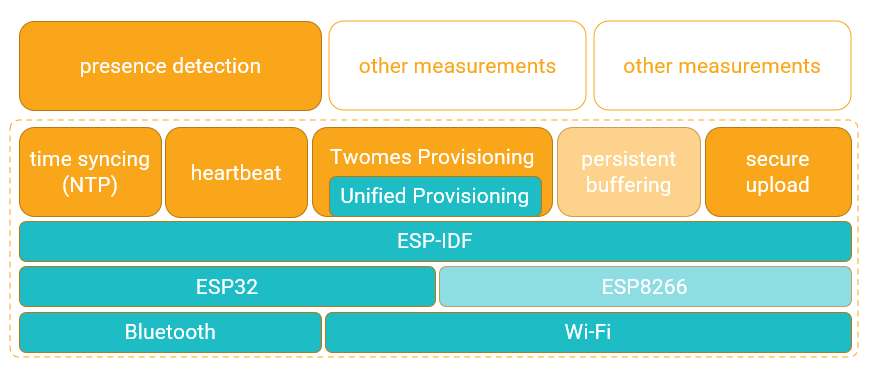

# Generic firmware for NeedForHeat measurement devices
This repository contains the generic firmware, with features common to various NeedForHeat measurement devices, based on an [ESP32](https://en.wikipedia.org/wiki/ESP32).

See [NeedForHeat presence detection documentation](https://www.energietransitiewindesheim.nl/needforheat-generic-firmware/deploying/configuring-presence-detection) for more specific information about the optional presence detection capabilities of this NeedForHeat generic firmware.

## Table of contents<!-- omit in toc -->
- [General info](#general-info)
- [Deploying](#deploying)
- [Developing](#developing)
- [Supported devices](#supported-devices)
- [Features](#features)
- [Status](#status)
- [License](#license)
- [Citation](#citation)
- [Credits](#credits)

## General info

Different NeedForHeat measurement devices may have various features in common, including device preperation, provisioning of home Wi-Fi network credentials via Bluetooth Low Energy (BLE) or via a temporary software access point (SoftAP), device-server activation, network time synchronisation, persistent buffering and secure uploading of measurement data. The generic firmware currently uploads the following data: 

| Sensor | Property or *timestamp*           | Unit | [Printf format](https://en.wikipedia.org/wiki/Printf_format_string) | Default measurement interval \[h:mm:ss\] | Description                            |
|--------|--------------------|------|--------|-------------------|----------------------------------------|
| [ESP32](https://en.wikipedia.org/wiki/ESP32)  | `heartbeat__0` |   | %d     | 0:10:00           | Incrementing counter indicating the device is working                       |
| [ESP32](https://en.wikipedia.org/wiki/ESP32)  | `battery_voltage__V` | V  | %.2f   | 0:10:00           | Measures the battery voltage                      |
| [ESP32](https://en.wikipedia.org/wiki/ESP32) Bluetooth  | `occupancy__p`         | [-]   | %u   | 0:10:00           | If enabled; number of smartphones responding to Bluetooth name request                        |
| [ESP32](https://en.wikipedia.org/wiki/ESP32) Bluetooth  | `onboarded__p`         | [-]   | %u   | 0:10:00           | If enabled; number of smartphones that were onboarded and that are regularly sent Bluetooth name requests                        |
| [ESP32](https://en.wikipedia.org/wiki/ESP32) device clock  | *`timestamp`* | [Unix time](https://en.wikipedia.org/wiki/Unix_time)   | %d   | 0:10:00           | Each measurement is timestamped |
| [ESP32](https://en.wikipedia.org/wiki/ESP32) device clock  | *`upload_time`* | [Unix time](https://en.wikipedia.org/wiki/Unix_time)   | %d   | 0:10:00           | Uploads of the contents of the secure upload queue to a [NeedForHeat server](https://github.com/energietransitie/needforheat-server-configuration) are timestamped |
| [ESP32](https://en.wikipedia.org/wiki/ESP32) internet | `booted_fw`         | version   | %s   | 48:00:00           | Version string of firmware on first boot after provisioning or OTA update                        |
| [ESP32](https://en.wikipedia.org/wiki/ESP32) internet | `new_fw`         | version   | %s   | 48:00:00  | If Over-The-Air (OTA) firmware updates are enabled; data is only logged when new valid firmware was downloaded |
| [ESP32](https://en.wikipedia.org/wiki/ESP32) internet  | (none yet)         | [-]   | %u   | 24:00:00           | Device clock is synchronized regularly via the internet over NTP (time skew will be recorded in a future version of the firmware) |

This software repository provides a shared libary for many of these common features. With this library, we also intend to make it easier to port software between NeedForHeat devices based on an ESP32 SoC. This facilitates development of firmware for NeedForHeat measurement devices.

## Deploying

Go to the [deploying section of the needforheat-generic-firmware library documentation](https://www.energietransitiewindesheim.nl/needforheat-generic-firmware/deploying/prerequisites/) to learn you can deploy binary releases of the firmware, i.e. without changing the source code, without a development environment and without needing to compile the source code.

## Developing 
Go to the [developing section of the needforheat-generic-firmware library documentation](https://www.energietransitiewindesheim.nl/needforheat-generic-firmware/starting/prerequisites/) to learn how you can change the source code using a development environment and compile the source code into a binary release of the firmware that can be deployed, either via the development environment, or via the method described in the section [Deploying](#deploying).

## Supported devices

Ths firmware currently only supports ESP32 devices. In particular, we tested on:

- [LilyGO TTGO T7 Mini32 V1.3 ESP32](https://github.com/LilyGO/ESP32-MINI-32-V1.3)
- [M5Stack CoreInk](https://github.com/m5stack/M5-CoreInk)`

## Features

**Ready and field tested:**

* Unified Provisioning over Bluetooth Low Energy (BLE; ESP32 only) and SoftAP
* Time synchronisation using NTP
* Secure transport over TLS/SSL (ESP32 only), using the [ISRG Root X1 certificate](https://crt.sh/?id=9314791)
* Heartbeats: regular measurement and upload of timestamped measurment data with property `heartbeat__0`
* Wi-Fi reset via long button press
* Example code
* Presence Detection (with deploy-time onboarding of static Bluetooth MAC addresses to be counted)
* And on [M5Stack CoreInk](https://github.com/m5stack/M5-CoreInk) only
  * Display QR-code on e-ink screen, for provisioning
  * Display Info?Scan! QR-code that links to device FAQ page on e-ink screen after provisionins
  * Run-time onboarding of smartphones to be counted, using menu on e-ink screen

**Ready but not field tested:**

* Persistent buffering of measurement data
* Over-the-Air (OTA) firmware updates

** To-Do (Desired Features) **

- **Log Time Skew After NTP Sync**:
  - Record and store the time skew observed after Network Time Protocol (NTP) synchronization to monitor and troubleshoot time-related issues.

- **Visual Indication of Device States**:
  - Implement visual feedback via LEDs, buzzer, and/or e-ink screen to indicate device states to the end user, including:
    - Ready for device activation.
    - Device activation in progress.
    - Last successful heartbeat transmission.

- **BASE45-Encoded QR-Code Payloads for Unified Provisioning**: 
  - These items require corresponding changes in the [NeedForHeat GearUp app](https://github.com/energietransitie/needforheat-gearup-app/blob/main/TODO-DESIRED.md#device-provisioning) to handle these payloads, including BASE45 decoding and `NFH://` scheme registration ([BASE45 RFC](https://datatracker.ietf.org/doc/rfc9285/)).
  - Generate QR-code payloads with BASE45-encoded alphanumeric deeplinks (e.g., `NFH://UJCLQE7W5812YF6KZWNTT8VCN10QTYG5`) for Espressif Unified Provisioning. Payload includes:
    - First 32 bits of SHA256 hash of `device_type.name`.
    - Last 24 bits of Bluetooth MAC address (last 3 octets).
    - Random `pop` value generated by ESP32’s true random number generator.
  - Use BASE45-decoded first 56 bits (11 alphanumeric characters) as the Bluetooth device name for EUP and remaining bits as the `pop` value. Encode using alphanumeric QR encoding to:
    - Enable smaller QR codes (e.g., version 2/3) for e-ink displays or challenging scanning conditions.
    - Support higher error correction levels for reliability.
    - Increase `pop` entropy (e.g., up to 147 bits vs. current 30 bits) for enhanced security.
  - Reduces name collision risks (e.g., 1 in 100,000 for 256 device types).  - 

- **Consume UseProductionServer Flag for Unified Provisioning**:
  - Update firmware to receive and process a boolean `UseProductionServer` flag during Espressif Unified Provisioning, sent by the app to configure whether data is sent to the test or production server. Eliminates the need for separate test/production firmware.
  - Requires corresponding implementation in the [NeedForHeat GearUp app](https://github.com/energietransitie/needforheat-gearup-app/blob/main/TODO-DESIRED.md#device-provisioning) to send the flag via dynamic links (or their future replacement).

## Status
Project is: in-progress

## License
This software is available under the [Apache 2.0 license](./LICENSE.md), Copyright 2021 [Research group Energy Transition, Windesheim University of Applied Sciences](https://windesheim.nl/energietransitie) 

## Citation

If you use this repository in your research or work, please cite the following pre-print, which describes the overall NeedForHeat DataGear system of which this repository is a part:

> Ter Hofte, H., & van Ravenzwaaij, N. (2025). *NeedForHeat DataGear: An Open Monitoring System to Accelerate the Residential Heating Transition*. arXiv preprint arXiv:2509.06927. https://doi.org/10.48550/arXiv.2509.06927

**Note:** This is a pre-print submitted on 8 Sep 2025 and has not yet been peer-reviewed. For the full paper, see [https://arxiv.org/abs/2509.06927](https://arxiv.org/abs/2509.06927).

## Credits
This software is made by:
* Nick van Ravenzwaaij ·  [@n-vr](https://github.com/n-vr)

Run-time onboarding for presence detection using the e-ink screen was recently added by: 
* Joël van de Weg · [@JoelvdWeg](https://github.com/JoelvdWeg)

Thanks also go to:
* Jorrin Kievit · [@JorrinKievit](https://github.com/JorrinKievit)
* Kevin Jansen ·  [@KevinJan18](https://github.com/KevinJan18)
* Sjors Smit ·  [@Shorts1999](https://github.com/Shorts1999)
* Stijn Wingens · [@stijnwingens](https://github.com/stijnwingens)
* Tiemen Molenaar · [@Tiemen-M](https://github.com/Tiemen-M)

Product owner:
* Henri ter Hofte · [@henriterhofte](https://github.com/henriterhofte)

We use and gratefully acknowlegde the efforts of the makers of the following source code and libraries:
* [ESP-IDF](https://github.com/espressif/esp-idf), by Espressif Systems, licensed under [Apache 2.0 license](https://github.com/espressif/esp-idf/blob/73db142403c6e5b763a0e1c07312200e9b622673/LICENSE)
* [bm8563](https://github.com/tuupola/bm8563), by [Mika Tuupola](https://github.com/tuupola), licensed under [MIT License](https://github.com/tuupola/bm8563/blob/master/LICENSE)
* [LovyanGFX](https://github.com/lovyan03/LovyanGFX), by [lovyan03](https://github.com/lovyan03), licensed under [FreeBSD](https://github.com/lovyan03/LovyanGFX/blob/master/license.txt)
