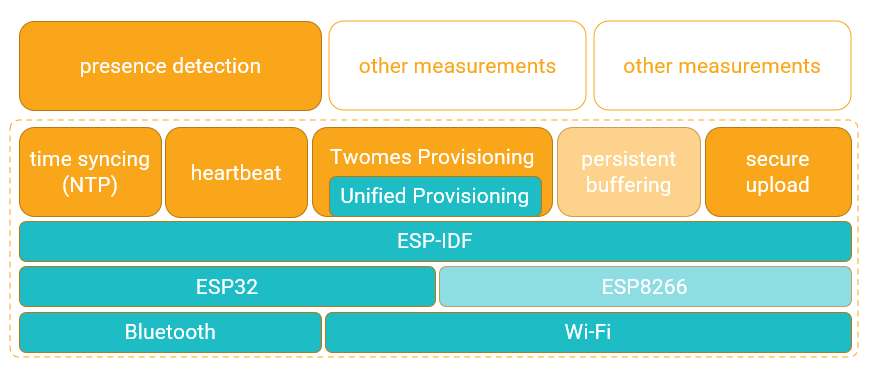

# Generic firmware for Twomes measurement devices
This repository contains the generic firmware, with features common to various Twomes measurement devices, based on an ESP32 SoC.

See [Twomes presence detection library](https://github.com/energietransitie/twomes-generic-esp-firmware/blob/main/lib/presence_detection/README.md) for more specific information about the optional presence detection capabilities of this Twomes generic firmware. 

## Table of contents
* [General info](#general-info)
* [Deploying](#deploying)
* [Developing](#developing) 
* [Releasing](#releasing)
* [Features](#features)
* [Status](#status)
* [License](#license)
* [Credits](#credits)

## General info



Different Twomes measurement devices may have various features in common, including device preperation, provisioning of home Wi-Fi network credentials via Bluetooth Low Energy (BLE) or via a temporary software access point (SoftAP), device-backend activation, network time synchronisation, persistent buffering and secure uploading of measurement data. This software repository provides a shared libary for many of these common features. With this library, we also intend to make it easier to port software between Twomes devices based on an ESP32 SoC, such as the [LilyGO TTGO T7 Mini32 V1.3 ESP32](https://github.com/LilyGO/ESP32-MINI-32-V1.3) and [M5-CoreInk](https://github.com/m5stack/M5-CoreInk). This facilitates development of firmware for Twomes measurement devices. In future releases, support might be extended to measurement devices based on an ESP8266 SoC, such as the [Wemos LOLIN D1 mini](https://www.wemos.cc/en/latest/d1/d1_mini.html).

## Deploying
This section describes how you can deploy binary releases of the firmware, i.e. without changing the source code, without a development environment and without needing to compile the source code.

### Prerequisites
*	a device based on an ESP32 SoC, such as the [LilyGO TTGO T7 Mini32 V1.3 ESP32](https://github.com/LilyGO/ESP32-MINI-32-V1.3);
*	a USB to micro-USB cable;
*	a PC with a USB port;
*	[Python v3.8 or above](https://www.python.org/downloads/) installed, and make sure to select `Add Python <version number> to PATH` so you can use the Python commands we document below from a command prompt;
*	[Esptool](https://github.com/espressif/esptool) installed, the Espressif SoC serial bootloader utility;
*	[PuTTY](https://www.chiark.greenend.org.uk/~sgtatham/putty/), a serial monitor utility (if your you are also developing, you may use the serial monitor utility in your IDE, instead).

### Erasing all persistenly stored data
Unless you are 100% sure that it is safe to only upload firmware and keep other persistent memory intact, you should always first completely erase the persistent (non-volatile) memory of the device. The procedure below not only erases the firmware, but also any device activation_token, Wi-Fi provisioning data and device session_token  that may reside in the persistent memory of the device and which is needed as bearer token that identifies, authenticates and authorizes the device when uploading measurement data to the server.
*	Open a command prompt and enter:
	```shell
	py -m esptool erase_flash
	```
*	If the port is not detected automatically, enter (while replacing `?`  with the digit found earlier):
	```shell
	py -m esptool erase_flash --port "COM?" 
	```
Should you encounter issues you may try to replace `py -m esptool` in the above commands with `python -m esptool` or `esptool.py`

After this command you should perform the full Twomes device provisioning flow below.

### Device preparation step 1: Uploading firmware tothe ESP32 device
*	Connect the device with a USB cable to the PC.
*	Download the [binary release for your device](https://github.com/energietransitie/twomes-generic-esp-firmware/releases) and extract it to a directory of your choice.
*	Some devices, such as the [LilyGO TTGO T7 Mini32 V1.3 ESP32](https://github.com/LilyGO/ESP32-MINI-32-V1.3), are based on the  CH340 USB to serial converter, which may not be recognized by your OS. You may need to install a specific usb driver on your computer before you can upload firmware:
	* [Windows driver](http://www.wch.cn/download/CH341SER_EXE.html);
	* [Mac OSX driver](http://www.wch.cn/download/CH341SER_MAC_ZIP.html) (see also [this additional info](https://kig.re/2014/12/31/how-to-use-arduino-nano-mini-pro-with-CH340G-on-mac-osx-yosemite.html));
	* [Linux driver](http://www.wch.cn/download/CH341SER_LINUX_ZIP.html);
	* [Android driver](http://www.wch.cn/download/CH341SER_ANDROID_ZIP.html).
*	If you used the device before, you shoud first [erase all persistenly stored data](#erasing-all-persistenly-stored-data)
*	Open a comand prompt in the directory you chose for the download, change the directory to the subfolder `binaries` and enter:
	```shell
	py -m esptool --chip esp32 --baud 460800 --before default_reset --after hard_reset write_flash -z --flash_mode dio --flash_freq 40m --flash_size detect 0x1000 bootloader.bin 0x18000 partitions.bin 0x1d000 ota_data_initial.bin 0x20000 firmware.bin  
	```
*	This should automatically detect the USB port that the device is connected to.
*	If not, then open the Device Manager (in Windows press the `Windows + X` key combination, then select Device Manager), go to View and click Show Hidden Devices. Then unfold `Ports (COM & LPT)`. You should find the device there, named `USB-Serial CH340 *(COM?)` with `?` being a single digit.  
*	If the COM port is not automatically detected, then enter (while replacing `?` with the digit found in the previous step): 
	```shell
	py -m esptool --chip esp32 --port "COM?" --baud 460800 --before default_reset --after hard_reset write_flash -z --flash_mode dio --flash_freq 40m --flash_size detect 0x1000 bootloader.bin 0x18000 partitions.bin 0x1d000 ota_data_initial.bin 0x20000 firmware.bin
	```
Should you encounter issues you may try to replace `py -m esptool` in the above commands with
```shell 
python -m esptool
````
or
```shell 
esptool.py
````

### Device preparation step 2: Establishing a device name and device activation_token 
* First, you should open your serial monitor utility.
	*  For [PuTTY](https://www.chiark.greenend.org.uk/~sgtatham/putty/), use the following destination settings (be sure to `Save` them to `Load` them conveniently later):
		* Connection type: `Serial`
		* Speed: `115200`
		* Serial line: `COM?` (replace `?` with the number of the COM-port your device is connected to, e.g., `COM5`). 
* Then, if your device is powered up (and running), briefly press the reset button. On the [LilyGO TTGO T7 Mini32 V1.3 ESP32](https://github.com/LilyGO/ESP32-MINI-32-V1.3), this button is labeled 'RST' and can be found if you look 90 degrees clockwise from the micro-USB connector.
* On the serial monitor window, shortly after you pressed the reset button, you will see handy strings that you can use in steps 3 and 4
	* a string you can copy and paste as the payload for the device creation [POST on the /device endpoint](https://api.tst.energietransitiewindesheim.nl/docs#/default/device_create_device_post) (see step 3), which looks something like<br>`{`<br>`"name":"TWOMES-D3AD48",`<br>`"device_type":"DSMR-P1-gateway-TinTsTrCO2",`<br>`"activation_token":"3375550652"`<br>`}`
	* a string the string for the QR-code payload (see step 4), which: 
		* for a device that supports Wi-Fi provisioning via Bluetooth Low Energy, looks something like<br>`{`<br>`"ver":"v1",`<br>`"name":"TWOMES-0D45DF",`<br>`"pop":"810667973",`<br>`"transport":"ble"`<br>`}` 
		* for a device that supports Wi-Fi provisioning via a temporary Wi-Fi Access Point set up by the device, looks something like<br>`{`<br>`"ver":"v1",`<br>`"name":“TWOMES-8E23A6",`<br>`"pop":“516319575",`<br>`"transport":"softap",`<br>`"security":"1",`<br>`"password":"516319575"`<br>`}`

### Device preparation step 3: Creating the device in the Twomes backend using device name and device activation_token   
The device name and activation_token you just established should be created in the database of the server backend that you're using. If you are using the Twomes test server API, you can do this via a [POST on the /device endpoint](https://api.tst.energietransitiewindesheim.nl/docs#/default/device_create_device_post), using the `device_type` and the device `name` and `activation_token` you just established. If you are using the Twomes test server API, you should use a `device_type` from the [list of pre-registered device type names in the twomes test server](https://github.com/energietransitie/twomes-backoffice-api/blob/master/src/data/sensors.csv). If you don't have an admin bearer session token, refer to [this section on the Twomes API](https://github.com/energietransitie/twomes-backoffice-api#deployment) how to obtain one.

### Device preparation step 4: Generating a QR-code
The `device.name` and `device.activation_token` of the device should be encoded in a QR-code that is printed and stuck to the back of the Twomes measurement device. In general, we follow [Espressif's QR-code format](https://github.com/espressif/esp-idf-provisioning-android#qr-code-scan). With a few additional conventions: we always use security and currently, support for SoftAP is not yet fully implemented nor fully documented. Watch this space for changes in the way the `name` key of the QR-code payload is used.

The QR-code payload is a JSON string representing a dictionary with key value pairs listed in the table below.

Payload information : 

| Key       	| Value used                           	| Example                                  	| Required                                                            	|
|-----------	|------------------------------------	|-----------------------------------------	|---------------------------------------------------------------------	|
| ver       	| Version of the QR code.            	| `v1`				               	| Yes                                                                 	|
| name      	| device.name	 		 	| `TWOMES-0D45DF`                             	| Yes                                                                 	|
| pop       	| device.activation_token              	| `810667973`				   	| Yes								 	|
| transport 	| Wi-Fi provisioning transport type 	| Either `softap` or `ble`	               	| Yes                                                                 	|
| security  	| Security during Wi-Fi provisioning  	| Either `0` or `1`		              	| Optional; considered `1` (secure) if not available in QR-code payload	|
| password  	| device.activation_token         	| Password to connect with SoftAP device. 	| Optional                                                            	|

To generate a QR-code, you can use any QR-code generator. When generating QR-codes for production use, you SHOULD use an offline QR-code gerator, such as [this chrome extension offline QR-code generator](https://chrome.google.com/webstore/detail/offline-qr-code-generator/fehmldbcmhbdkofkiaedfejkalnidchm), which also works in the Microsoft Edge browser. A device activation_token might constitute personal information since it is used in a process that might link personally identifiable information of subjects to measurement data. Simply encode the example payload you find below. Note: the payload is NOT a URL, so it should NOT start with `http://` nor with `https://`; the QR-code just includes a list of JSON key-value pairs).

### Erasing only Wi-Fi provisioning data
To change the name and/or associated password of the Wi-Fi network that a measurement device is connected to, we recommend an enclosure design that has only one end-user accessibe button. End users should hold down this button for more than 10 seconds to do a Wi-Fi reset and provision the device with a new Wi-Fi network. 

On a bare [LilyGO TTGO T7 Mini32 V1.3 ESP32](https://github.com/LilyGO/ESP32-MINI-32-V1.3) development board with the generic Twomes firmware in this repository, this button is labeled  'BOOT'. You can find it just above the micro-USB port. 

On measurement devices that will be deployed in the field, this button is typically covered by a shield in the Wemos D1 Mini form factor and an enclosure; their designs preferably should have a recessed button behind a small hole in the enclosure, which makes it hard to press this button accidentally, but easy to press deliberately with a bent paperclip (in our experience, using a pen or pencil requires a hardware design with a robust button that can withstand the considerable forces that humans can apply with these tools, which is larger than the force applied by a bent paperclip).

In hardware designs that require the end users to start with a (short) button press, e.g. to establish a link between a satellite measurement device and a measurement device that acts as a gateway, a more easily accessible button may be used. For a measurement device that also acts as a gateway, a long press on this button can be used to trigger erasing the Wi-Fi provisioning data.

When you release the button after holding it down for more than 10 seconds, the Wi-Fi provisioning data is deleted from persistent (non-volatile) memory. 

We noticed that some devices require a full power down and power up cycle to properly start the Wi-Fi provisioning process again. 

Note that this procedure:
* will NOT erase nor change the device name, nor the device activation_token;
* will NOT erase the bearer authorisation token needed to upload measurement data to the server;
* will not cause a call on the /device/activate endpoint on the server. 

Note also that the Wi-Fi provisioning data is stored in persistent (non-volatile) memory and will NOT be erased when you upload new firmware. Hence, it is possible to update the firmware without the need to print and attach a new QR-code to the device.

### Repurposing an existing device
If you want to repurpose and existing device (e.g. use it in another home), you should:
* erase all persistently stored data on the device;
* after the value in the `name` column of the existing device entry in the database, add `-OLD` and click on `SAVE` (for the Twomes test database, you can do this via [CloudBeaver](https://db.energietransitiewindesheim.nl/#/));
*  proceed with regular device preparation.

## Developing 
This section describes how you can change the source code using a development environment and compile the source code into a binary release of the firmware that can be deployed, either via the development environment, or via the method described in the section [Deploying](#deploying).

### Prerequisites
Prerequisites for deploying, plus:
*	[Visual Studio Code](https://code.visualstudio.com/download) installed
*	[PlatformIO for Visual Studio Code](https://platformio.org/install/ide?install=vscode) installed
*	In [Visual Studio Code](https://code.visualstudio.com/download), open a PlaformIO Command Line Interface and enter
	```shell
	pio platform update
	```
*	If your user directory name contains a whitespace, you may need to change the platformio.ini file. To avoid the error message "Error: Detected a whitespace character in project paths" when building an ESP-IDF project with PlatformIO, add the following lines to the platformio.ini file, as documented in https://docs.platformio.org/en/latest/frameworks/espidf.html#limitations:  
	```
	[platformio]
	core_dir = <path_without_whitespaces>
	```
*	This GitHub repository cloned

### Coding and uploading  
Open the project in PlatformIO:
  1. In the top-left corner, select File -> Open Folder.
  2. Select the folder where you cloned or extracted the repository.
  3. In the `src` folder you will find `main.c`; this is an example application.
  4. In the `lib` folder you will find the library that this repository contains.
  5. To change between provisioning via BLE or SoftAP, in the `platformio.ini`file, comment the line including `-DCONFIG_EXAMPLE_PROV_TRANSPORT_BLE` and uncomment the line including `-DCONFIG_EXAMPLE_PROV_TRANSPORT_SOFTAP` or vice versa.
  6. Change the code in `src/main.c` as you see fit.
  7. Click the PlatformIO Icon (the little alien in the left of the screen).
  8. Unfold `M5STACK_COREINK` when building for M5CoreINK, for other platforms unfold `ESP32DEV`.
> NOTE: Do not use the 'ESP32DEV' environment for M5CoreINK board! It does work, but some features specific to the M5CoreINK will not be included in the firmware, which cause problems during run-time.
  9. Click `Upload and Monitor`. 
NOTE: The first time might take a while because PlatformIO needs to install and build the ESP-IDF before it can upload the firmwware.
  10. When it is done uploading, press `CTRL+T` and then `B`, then type `115200` so that it sets the right baud rate and you see text not gibberish.
  11. To provision the device with Wi-Fi connectivity, use an app that supports Espressif Unified Provisioning. A list can be found below. 

### Testing device preparation
See the device preparation steps under [deploying](#deploying)

### Testing device installation
Use the [Twomes WarmteWachter app](https://github.com/energietransitie/twomes-app-warmtewachter) to test the full Twomes device installation flow, which is based on using Espressif Unified Provisioning. 

Alternatively, you may use test apps that only support Wi-Fi provisioning using Espressif Unified Provisioning; these can be found at:
* [Android Unified Provisioning app for BLE](https://play.google.com/store/apps/details?id=com.espressif.provble&hl=en&gl=US)
* [Android Unified Provisioning app for SoftAP](https://play.google.com/store/apps/details?id=com.espressif.provsoftap&hl=en&gl=US)
* [Apple Unified Provisioning app for BLE](https://apps.apple.com/us/app/esp-ble-provisioning/id1473590141)
* [Apple Unified Provisioning app for SoftAP](https://apps.apple.com/us/app/esp-softap-provisioning/id1474040630)

### Uploading measurements (example: uploading heartbeats) 
The generic firmware includes source code for timestamped measurement `heartbeat` data, indicating to the Twomes backend the device is "alive", a behavior that is mandatory for each Twomes measurement device. The source code also includes code to upload heartbeat measurements via [POST /device/measurements/variable-interval](https://api.tst.energietransitiewindesheim.nl/docs#/default/device_upload_variable_device_measurements_variable_interval), the endpoint you should use if you want to upload a series of measurement values that each have a timestamp. The JSON payload for the body such a request looks like this:
```
{
  "upload_time": "1622237550",
  "property_measurements": [
    {
      "property_name": "heartbeat",
      "measurements": [
        {
          "timestamp": "1622237550",
          "value": "1"
        }
      ]
    }
  ]
}
```

The [POST /device/measurements/variable-interval](https://api.tst.energietransitiewindesheim.nl/docs#/default/device_upload_variable_device_measurements_variable_interval) endpoint ignores measurements with empty `values`. Our advice is to count the number of heartbeats since the last reset and upload the counter as an integer in the `value` field.

You can use the source code for the timestamping and uploding of the `heartbeat` property as an example for the timestamping and uploading of the properties measured by your specific Twomes measureement device. 

Note that currently, persistent buffering is not supported fully in the generic firmware yet, so we decided to measure and timestamp heartbeats only hourly and upload each heartbeat seperately. Having a single measurement in an upload, with a `timestamp` (nearly) identical to the `upload_timestamp` is an exception, rather than the rule, however.  In future versions of the generic firmware we will measure and timestamp hearbeats every 10 minutes and persistently buffer them until we upload them hourly in a single upload call to [POST /device/measurements/variable-interval](https://api.tst.energietransitiewindesheim.nl/docs#/default/device_upload_variable_device_measurements_variable_interval).

Also note that we don't use the [POST /device/measurements/fixed-interval](https://api.tst.energietransitiewindesheim.nl/docs#/default/device_upload_fixed_device_measurements_fixed_interval_post) endpoint for heartbeat measurements, since that endpoint is intended for uploading series of measurements by devices that struggle to timestamp each measurement value seperately, but that are able to indicate the (fixed) interval between the measurements as well as a timestamp for the first or the last measurement in the the series.

### Other Things To Keep In Mind
* Check the platformio.ini file in the cloned folder, look at the board_upload.flash_size, board_upload.maximum_size and board_build.partitions to check if they are right for your hardware.

### Configure the schedule (M5CoreINK only)
For the M5STACK_COREINK environment you can change the schedule by changing the array named `scheduler_t array[]` in the `main.c` file. Every item of this array has the following form:</br> `{<task_function>,<task_name>,<StackDepth>,{0,<arguments>},<priority>,<interval>}`

Here below you see an example of a schedule configuration:
```c
// schedule configuration
const interval_t min_tasks_interval_s = SCHEDULER_INTERVAL_5M;

scheduler_t schedule[] = {
	{heartbeatv2_task, "heartbeat", 4096, {0, NULL}, 1, SCHEDULER_INTERVAL_5M},
	{twomes_scd41_task, "twomes scd41", 4096, {0, NULL}, 1, SCHEDULER_INTERVAL_5M},
	{upload_task, "upload_task", 4096, {0, NULL}, 1, min_tasks_interval_s},
#ifdef CONFIG_TWOMES_OTA_FIRMWARE_UPDATE
	{twomes_ota_firmware_update_task, "firmware update", 16384, {0, NULL}, 1, SCHEDULER_INTERVAL_1D},
#endif
};

int schedule_size = sizeof(schedule)/sizeof(scheduler_t);
```
NOTE: make sure the upload queue is large enough to hold all measurements data for at least two intervals, to prevent that measurements get lost. You can modift the upload queue size in the `upload.h` file.
### Create new task (M5CoreINK only)
#### Normal task blueprint
```c
#include <scheduler.h>

Void ExampleNormalTask(void *arg) {
	/* .. Put here some code .. */

	// the following statements are executed at the end
	xEventGroupSetBits(scheduler_taskevents, GET_TASK_BIT_FROM_ARG(arg));
	vTaskDelete(NULL);
}
```
Here above you see a blueprint of a normal task that is valid to be managed by the scheduler. A valid task has the following properties:
- It takes one argument of the type of void pointer.
- It has no infinite loops; the task must end.
- It set its bit in event group when the task is done.
- The task deletes itself at the end.
- The task is short as possible. This will maximize the time that the system can sleep.
#### Waiting task blueprint
When your task needs to wait for other tasks to end. You may use the `scheduler_task_finish_last` function. This function waits until all normal task are not running anymore. Futhermore here apply the same rules than by normal task. Here below you see a blueprint of a waiting task. 
```c
#include <scheduler.h>

void ExampleWaitingTask(void *arg) {
	/* … some code … */

	// wait until all normal task are ended
	scheduler_task_finish_last(GET_TASK_BIT_FROM_ARG(arg));

	/* … some code … */

	// tell that is stopped
	xEventGroupSetBits(scheduler_taskevents, GET_TASK_BIT_FROM_ARG(arg));
	vTaskDelete(NULL);
}
```
#### Let your task put measurements to the upload queue
In order to sent measurments to the server. The task need to put the measurments on the upload queue. You do this by the folowing steps:
1. First create a `measurment_t` object and fill it with data.
2. Then use xQueueSend function from FreeRTOS to put this object on the `upload_queue`

Here below show how it may be look like:
```c
measurement_t object = {<property_type>,<time stamp>,<value>};
xQueueSend(upload_queue, (void *) &object,portMAX_DELAY);
```
#### Add support for a new property
If no corresponding property has yet been defined for the quantity that you want to sent to the server. You need to add it to `property_format.c` and `property_format.h` by the following steps:
1. Open `property_format.h` and add a new element with the name of the new property in uppercase to the `property_t` enum.
2. Next open `property_format.c`
3. Add to the array `format_property` a format string for the new property on the same row than you did by the enum. This is also true for the following two steps.
4. Next add to the `name_of_property` array the name of the new property as string
5. Add to the `format_function_of_property` array the function that correctly process the `measurement_t` object for that new property.
NOTE: The new property needs also be defined on server side for each device type where you want to use it, otherwise the server will reject the property. [Click Here](https://github.com/energietransitie/twomes-backoffice-api#deploying-new-properties-to-apitstenergietransitiewindesheimnl) to read about it. 

## Releasing
Read more on how to create an automated release [here](RELEASING.md).

## Features
Currently ready:

* Unified Provisioning over Bluetooth Low Energy (BLE; ESP32 only) and SoftAP
* Time synchronisation using NTP
* Secure transport over TLS/SSL (ESP32 only), using the [ISRG Root X1 certificate](https://crt.sh/?id=9314791)
* Heartbeats: hourly measurement and upload of timestamped measurment data with property `heartbeat`
* Long button press to erase only Wi-Fi provisioning data 
* Example code
* Presence Detection (compile time provisioning of tracked Bluetooth addresses)

To-do:

* Visual indication via the red and/or green LEDs that allows the end user to recognize various device states
 	* ready for device activation: blinking green LED 
 	* device activation: turning green LED on for a few seconds
 	* sending a heartbeat: blink green LED rapidly two times
NOTE: For the M5CoreINK you can also use the buzzer. But use the buzzer only during the activation stage, it can potentially annoy people!  
* Persistent buffering of measurement data
* Presence Detection (provisioning of tracked Bluetooth addresses during device provisioning)
* Presence Detection (runtime Bluetooth addresses provisioning)
* Support for ESP8266

## Status
Project is: in-progress

## License
This software is available under the [Apache 2.0 license](./LICENSE.md), Copyright 2021 [Research group Energy Transition, Windesheim University of Applied Sciences](https://windesheim.nl/energietransitie) 

## Credits
This software is made by:
* Kevin Jansen ·  [@KevinJan18](https://github.com/KevinJan18)
* Nick van Ravenzwaaij ·  [@n-vr](https://github.com/n-vr)

Thanks also go to:
* Sjors Smit ·  [@Shorts1999](https://github.com/Shorts1999)
* Tiemen Molenaar · [@Tiemen-M](https://github.com/Tiemen-M)

Product owner:
* Henri ter Hofte · [@henriterhofte](https://github.com/henriterhofte) · Twitter [@HeNRGi](https://twitter.com/HeNRGi)

We use and gratefully acknowlegde the efforts of the makers of the following source code and libraries:
* [ESP-IDF](https://github.com/espressif/esp-idf), by Espressif Systems, licensed under [Apache 2.0 license](https://github.com/espressif/esp-idf/blob/73db142403c6e5b763a0e1c07312200e9b622673/LICENSE)
* [bm8563](https://github.com/tuupola/bm8563), by [Mika Tuupola](https://github.com/tuupola), licensed under [MIT License](https://github.com/tuupola/bm8563/blob/master/LICENSE)
* [cJSON](https://github.com/DaveGamble/cJSON), by [Dave Gamble and cJSON contributors](https://github.com/DaveGamble/cJSON/graphs/contributors), licensed under [MIT License](https://github.com/DaveGamble/cJSON/blob/master/LICENSE)
