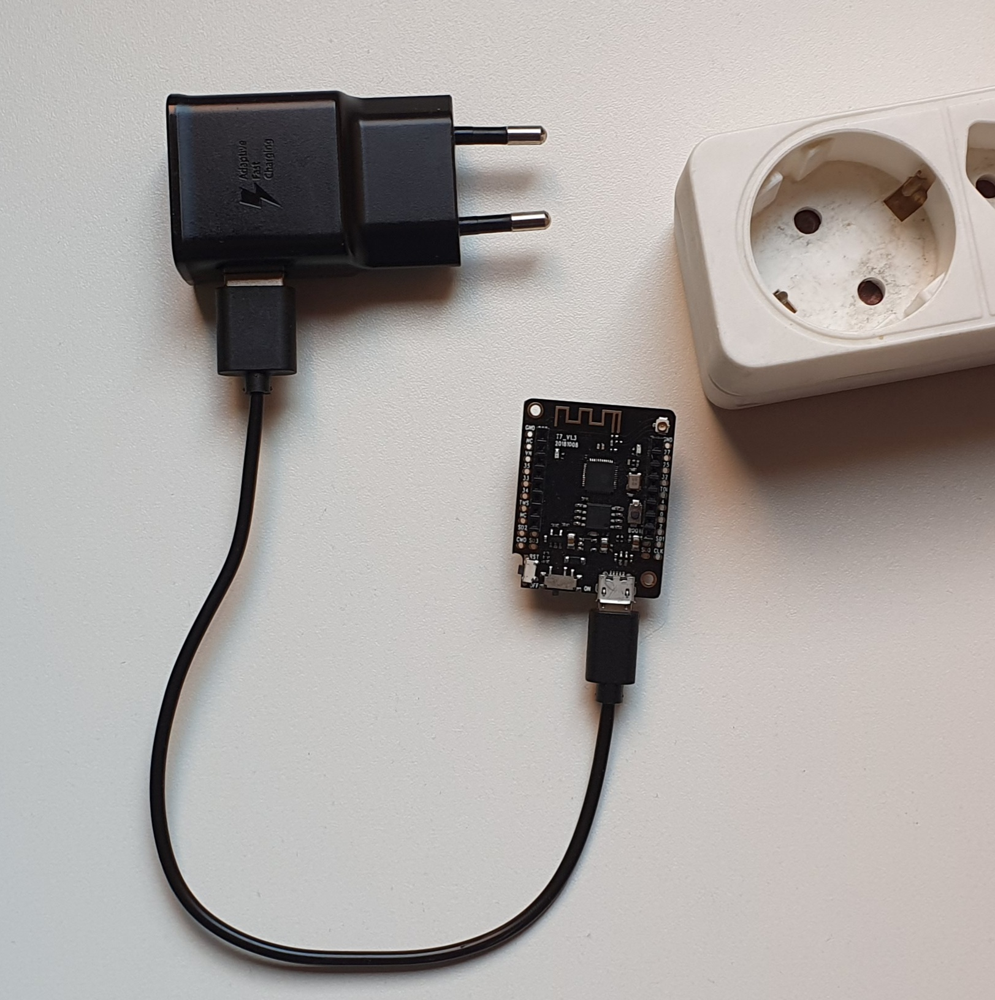

# Twomes Measurement Device Installation Manual

The purpose of a device installation manual is to help users physically install and power up devices of your specific measurement device type. The contents of the folder [/docs/installationmanual/](/docs/installationmanual/) of a Twomes measurement device repository can be used as a template for this. 

## Prerequisites
You only need a web browser and a plain text editor (or your favourite IDE).

## Writing
Adapt the content of `index.html` to fit the needs of your measurement device type. Be sure to write in the language the intended audience of the [Twomes provisioning app](https://github.com/energietransitie/twomes-app-warmtewachter). After scanning its QR-code, the manual of your device type is presented to the user by the [Twomes provisioning app](https://github.com/energietransitie/twomes-app-warmtewachter). 

Do not change the existing styles in the stylesheet; doing so would ruin consistency with the visual style of installation manuals of other devices. Instead, add additional style rules for any custom styling that you may require. Morerover, do not change the content of the file `preview.html`; its purpose is to mimic the way your `index.html` is displayed by the Twomes app.

The default styles are:
* `div.video-block` with predefined styling for (embedded videos);
* `div.image-block` with predefined styling for images;
* `div.text-block` with predefined styling for texts.

## Previewing
Open the file `preview.html` using a regular web browser to preview your manual as shown in the Twomes app. To make the preview resemble the size and aspect ratio of a smartphone screen:
1. Press the `Ctrl + Shift + I` keys (or `F12` ) on your keyboard to access the Developer Tools.
2. Press the `Ctrl + Shift + M` keys on to enter (mobile) device emulation mode.

By default, your preview is now in 'Responsive' mode. Using the dropdown menu (above the preview), you can also select custom dimensions for specific devices, such as the iPhone 6/7/8.

## Deploying
Upload the contents of the manual folder to the server to make it available in the Twomes app. Be sure to include all files in the `/docs/installationmanual` folder of your device: not only the the file `index.html`, but also all resources referred to in this file, like images.

For the [Twomes WarmteWachter app](https://github.com/energietransitie/twomes-app-warmtewachter), files must be uploaded to `https://energietransitiewindesheim.nl/manuals/<device_type.name>/`. 
You cannot upload your manual to that destination yourself. Instead, you should request [@hterhofte](https://github.com/hterhofte) to do this, by creating a pull request and requesting him explicitly to review your pull request and upload your files. After uploading, the Twomes WarmteWachter app can display the installation manual. 

Example: the installation manual for the `Generic-Test` device type is available at: [https://energietransitiewindesheim.nl/manuals/Generic-Test/](https://energietransitiewindesheim.nl/manuals/Generic-Test/)

> In a future version of this repository, we plan do automate building and deploying installation manual pages to GitHub Pages. Most likely, the deployment will be to the `/<github-repository-name>/installationmanual/` folder of your GitHub pages server. For the Twomes Generic-Test measurement device, this will most likely be [https://energietransitiewindesheim.nl/twomes-generic-esp-firmware/installationmanual/](https://energietransitiewindesheim.nl/twomes-generic-esp-firmware/installationmanual/); for the Twomes Presence Detection measurement device, this will most likely be [https://energietransitiewindesheim.nl/twomes-presence-detector/installationmanual/](https://energietransitiewindesheim.nl/twomes-presence-detector/installationmanual/)
